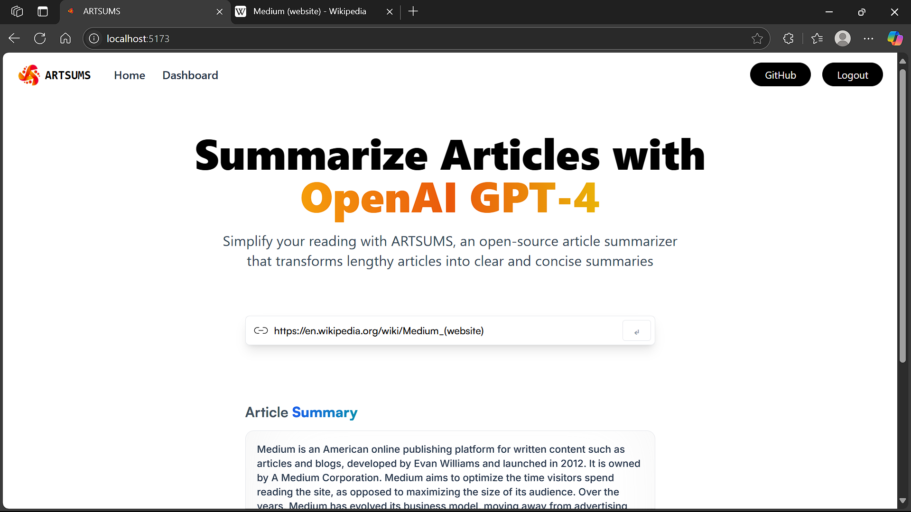
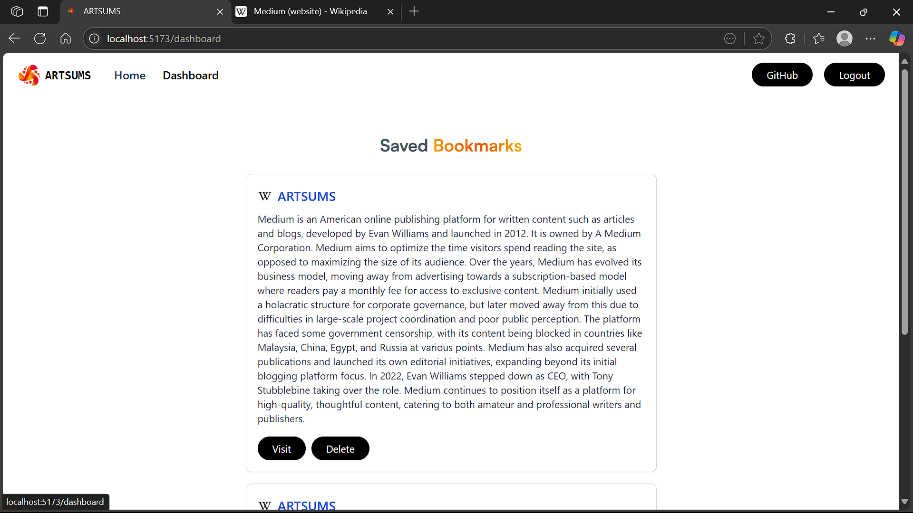

# 📰 ARTSUMS - Article Summarizer with AI

ARTSUMS is a modern, responsive web application that summarizes lengthy articles using OpenAI-powered APIs. It features Firebase Authentication for login/signup and allows users to save, view, and delete their personal article summaries using localStorage (per user).

 <!-- optional preview image -->

---

## ✨ Features

- 🔍 Summarize any article using [RapidAPI](https://rapidapi.com/restyler/api/article-extractor-and-summarizer) (GPT-based)
- 🔐 Login/Register using Firebase Authentication (email/password)
- 💾 Save article summaries to localStorage (per logged-in user)
- 🗂 View and delete saved bookmarks (includes favicon, title, URL, summary)
- 🎨 Clean UI with Tailwind CSS
- 🔒 Protected routes using React Router

---

## 🖼️ Preview

| Home (Search + Summary) | Bookmarks Dashboard |
|--------------------------|---------------------|
|  |  |

---

## 🛠 Tech Stack

- ⚛️ React + Vite
- 🔐 Firebase Authentication
- 🧠 OpenAI Summarization API (via RapidAPI)
- 💾 localStorage (user-scoped)
- 🧭 React Router v6
- 🎨 Tailwind CSS

---

## 🚀 Getting Started

### 1. Clone the repo

```bash
git clone https://github.com/Satyam070/ArticleSummariser.git
cd ArticleSummariser
````

### 2. Install dependencies

```bash
npm install
```

### 3. Setup `.env` file

Create a `.env` file in the root directory:

```env
VITE_RAPID_API_ARTICLE_KEY=your_rapidapi_key
```

Also configure Firebase and add your web config to `firebase.js`.

---

## 📁 Folder Structure

```
src/
│
├── assets/               # logo, icons, illustrations
├── components/           # UI components: Hero, Demo, Auth, Navbar, etc.
├── routes/               # ProtectedRoute & PublicRoute wrappers
├── services/             # API logic (RTK Query + firebase.js)
├── context/              # Firebase AuthContext provider
└── App.jsx               # Routes and layout
```

---

## 🧪 Test User (for demo)

```txt
email: demo@artsums.com
password: artsums123
```

---

## 📦 Deployment

You can deploy this app easily on:

* 🔥 Firebase Hosting
* ▲ Vercel
* 🌐 Netlify

---

## 🔒 Security Notes

* Bookmarks are stored in `localStorage`, scoped per `firebaseUser.uid`
* All route access is protected with `onAuthStateChanged()` wrapper
* Summarization is powered by a 3rd-party API (requires API key)

---

## 🙌 Credits

* Built by [@Satyam070](https://github.com/Satyam070)
* Summary API by [RapidApi AI](https://rapidapi.com/restyler/api/article-extractor-and-summarizer)
* Firebase Auth + Tailwind UI inspired from [fireship.io](https://fireship.io/)

---


